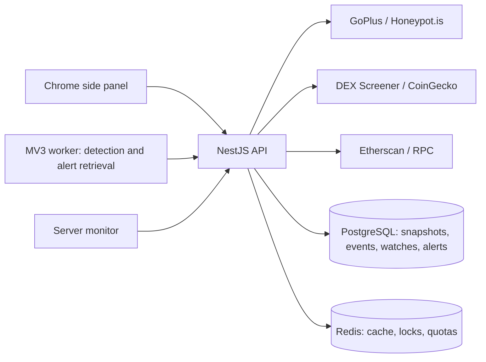

# Architecture and API

## Components

`apps/extension` contains the React/TypeScript panel and MV3 service worker. `apps/api` contains NestJS routes, authentication, storage, adapters, deterministic analysis, and monitoring. `packages/shared` contains strict schemas, the network registry, evidence types, risk labels, and report comparison. API credentials remain on the server.

The browser preview uses the same UI/API client. Only native Chrome controls are unavailable there. The sample report is fictional, labelled, and cannot be watched or refreshed as a real scan.

## Scan lifecycle

The server validates chain and checksum-aware EVM address, obtains provider responses with timeouts and bounded JSON sizes, verifies market pools against token/network identity, and validates the simulation's returned token/network/pool/route. A rule-versioned cache shares public evidence; separate ownership links protect each installation's private scan history. A distributed lock prevents duplicate concurrent scans.

Results are immutable JSON snapshots. Source verification, audit availability, proxy detection, current owner, role history, and trading simulation are separate facts. Findings include limitations and references. `RULES_VERSION` changes when interpretation changes so earlier cached assessments are not reused under different rules.

GoPlus fees are fractions; Honeypot fees are percentages. Unknown fields remain null. Unsupported simulation results are retained but excluded from trading conclusions/tax metrics. Market price/FDV applies only when the scanned token is the indexed base token. Lock percentages require a single matching fungible pool; concentrated positions remain explicitly not established. Holder concentration excludes known contracts/burn addresses but does not infer beneficial ownership.

## Persistence and history

Tables: `devices`, `reports`, `device_reports`, `watches`, `alerts`, `event_cursors`, `token_events`, and `schema_migrations`. Startup migration uses a PostgreSQL advisory transaction lock. Devices store only SHA-256 token hashes; bearer credentials have 256 bits of randomness.

RPC reads use a captured block number. Standard ownership, role, upgrade, and mint/burn logs are indexed within configurable recent-block bounds and persisted between scans. Log-query gaps and truncation are disclosed. This is not lifetime history, an exhaustive custom-event decoder, an authority audit, or a reorg-finality guarantee. Older saved events can appear alongside new indexed events. Etherscan deployment and DEX pool creation are distinct entries; project descriptions remain third-party metadata.

Comparison requires matching chain/token/user-selected pool. Unknown-to-known transitions are not called proven changes. Liquidity is compared only for the same actual selected pool. Monitoring atomically claims due watches, limits batches, preserves the last report after failure, and records changes/alerts. New warnings, changed known controls, source-coverage loss, raised taxes and same-pool liquidity declines are eligible; thresholds filter tax/liquidity alerts.

## API

All paths use `/api/v1`. Requests and responses are JSON; maximum request body 16 KiB. `POST /devices` creates an anonymous installation and returns `{id, token}`. It and `GET /capabilities` are public. Every other route requires `Authorization: Bearer <installation token>`.

| Method     | Path                                         | Purpose                                                            |
| ---------- | -------------------------------------------- | ------------------------------------------------------------------ |
| POST       | `/scans`                                     | `{chainId,address,pairAddress?,refresh?}`; returns recorded report |
| GET        | `/reports/:id`                               | This installation's recorded report                                |
| GET        | `/reports/:id/evidence`                      | Evidence references and full recorded sources                      |
| GET        | `/history?chainId=…&address=…&pairAddress=…` | Up to 50 matching private snapshots                                |
| GET        | `/compare?previous=…&current=…`              | Known-field changes between owned snapshots                        |
| GET / POST | `/watches`                                   | List or upsert a watch (maximum 50 per installation)               |
| DELETE     | `/watches/:id`                               | Stop a watch; related alerts are removed                           |
| GET        | `/alerts`                                    | Latest 100 change alerts                                           |
| PATCH      | `/alerts/:id`                                | Mark an owned alert read                                           |
| POST       | `/resolve`                                   | Verify a DEX pool and return its base token                        |
| DELETE     | `/device`                                    | Remove private identity, report access, watches, and alerts        |

Watch fields: `chainId`, `address`, optional `pairAddress`/`label`, `intervalMinutes` (5–1440), `taxThreshold` (0–100), `liquidityDropPercent` (1–100). Missing thresholds default to 15 minutes, 10% tax, and 30% liquidity reduction.

`/health/live` reports process availability; `/health/ready` checks PostgreSQL and Redis. Invalid requests return 400; missing identity 401; inaccessible objects 404; quota/concurrent scans 429; unavailable storage 503. Unexpected errors conceal credential-bearing implementation details.
